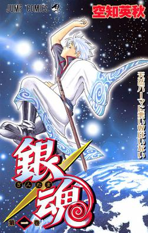

# Gintama Recommendations

| ANIME_ID | NAME | GENRE | TYPE | EPISODE | RATING | MEMBERS | DISTANCE |
| -- | -- | -- | -- | -- | -- | -- | -- |
|918|Gintama|Action, Comedy, Historical, Parody, Samurai, Sci-Fi, Shounen|TV|201|9.04|336376|0|
|9969|Gintama&#039;|Action, Comedy, Historical, Parody, Samurai, Sci-Fi, Shounen|TV|51|9.16|151266|0.04|
|28977|Gintama°|Action, Comedy, Historical, Parody, Samurai, Sci-Fi, Shounen|TV|51|9.25|114262|0.06|
|15417|Gintama&#039;: Enchousen|Action, Comedy, Historical, Parody, Samurai, Sci-Fi, Shounen|TV|13|9.11|81109|0.07|
|34096|Gintama (2017)|Action, Comedy, Historical, Parody, Samurai, Sci-Fi, Shounen|TV|12|9.1|23383|0.93|
|15335|Gintama Movie: Kanketsu-hen - Yorozuya yo Eien Nare|Action, Comedy, Historical, Parody, Samurai, Sci-Fi, Shounen|Movie|1|9.1|72534|2.08|
|7472|Gintama Movie: Shinyaku Benizakura-hen|Action, Comedy, Historical, Parody, Samurai, Sci-Fi, Shounen|Movie|1|8.59|51185|2.09|
|21899|Gintama: Yorinuki Gintama-san on Theater 2D|Action, Comedy, Historical, Parody, Samurai, Sci-Fi, Shounen|Movie|2|8.6|11104|2.12|
|9735|Gintama: Shinyaku Benizakura-hen|Action, Comedy, Historical, Parody, Samurai, Sci-Fi, Shounen|Special|1|8.31|14002|2.12|
|25313|Gintama: Jump Festa 2014 Special|Action, Comedy, Historical, Parody, Samurai, Sci-Fi, Shounen|Special|1|8.2|13764|2.12|
