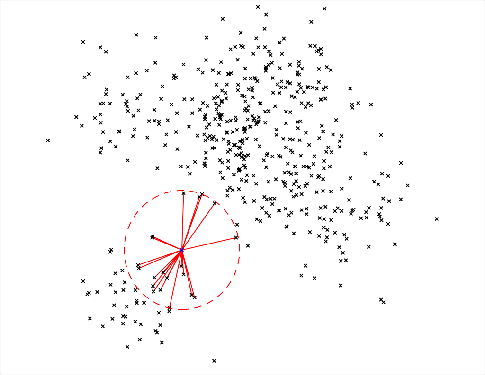

# Nearest neighbours

* To visualize how nearest neighbours can be used as recommendations lets look at a sample space with only two features.
* Here to evaluate data points most similiar to a certain data point, we'll choose the one closest to it.
* The closeness we'll define as the euclidean distance.
* So in 2D the euclidean distance would just be the length of the line as seen in the figure.

[[source]](https://erikbern.com/2015/09/24/nearest-neighbor-methods-vector-models-part-1.html)
* In this case we point out the top 20 recommendations or the 20 closest points.
* Here you can also figure why normalization is so important, say if feature along X - axis was not normalized and stretched (range 0-100) and y-axis was (range 0-1) then likeness would've been heavily influenced by the feature along X - axis. ~ Something to remember since we can use this to our advantage.
