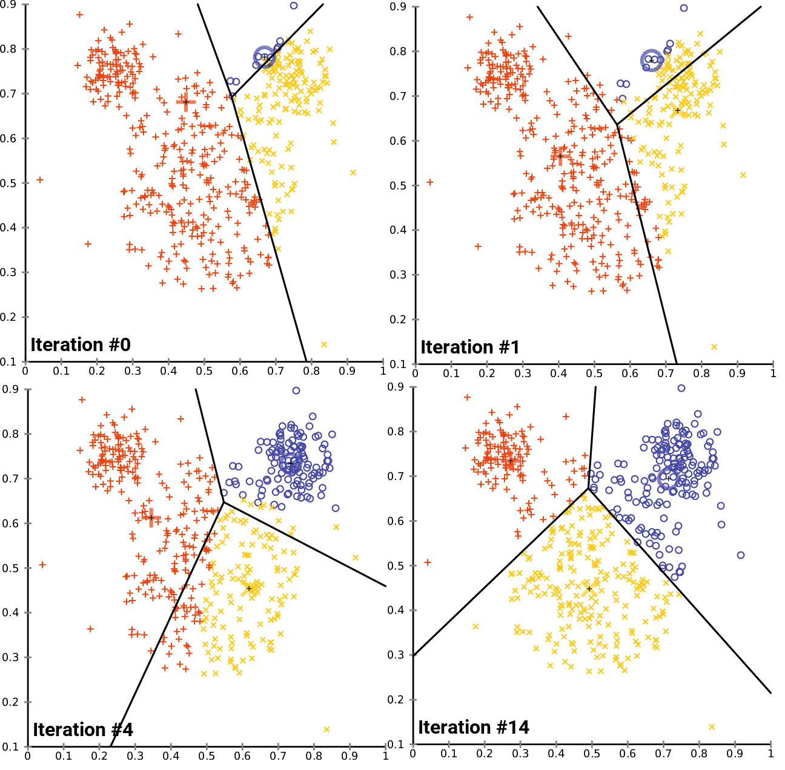

# K means

K means

Let's discuss a bit about the standard algorithm for K-means also reffered to as Lloyd's algorithm.

This mainly involves a repitition of two steps 'Assignment and Update' after an initial assignment of some k means.
* `Assignment`
    * This step is for assigning cluster id's to data points, i.e. a cluster is chosen for each data point based on which cluster mean is closest to it.
    * Closeness is measured by euclidean distance.
* `Update`
    * This step is for updating the k means to the updated mean of the data points belonging with that cluster

The following images might make this algorithm clearer.

[[source]](https://en.wikipedia.org/wiki/K-means_clustering#Standard_algorithm)
